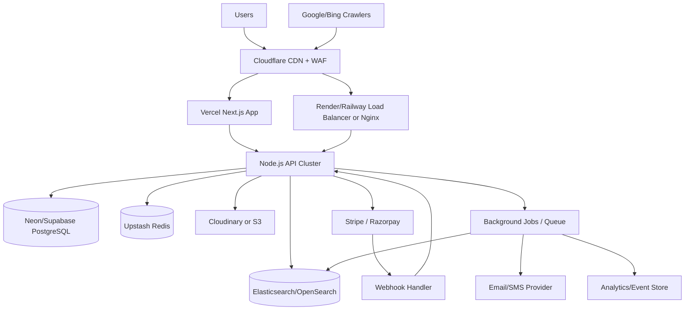

# HPC Ultra Production Architecture Plan

## 1. Target Architecture



## 2. Recommended System Design

- Frontend: Next.js App Router with SSR, ISR, route segment caching, image optimization, and schema markup.
- Backend: Node.js + Express modular monolith first, split by domain boundaries only when traffic or team size forces it.
- Database: PostgreSQL for source-of-truth transactional data.
- Cache: Redis for API response caching, sessions, rate-limits, carts, and search suggestion cache.
- Search: Elasticsearch/OpenSearch for catalog search, facets, autocomplete, and ranking.
- Storage: Cloudinary for product media transformation and CDN-backed delivery.
- CDN/WAF: Cloudflare for edge caching, bot protection, and DDoS absorption.
- Async processing: BullMQ or a lightweight worker process for indexing, emails, payment reconciliation, low-stock alerts, and analytics fan-out.

## 3. Why This Shape

- A modular monolith is the lowest-cost architecture that still scales well to 100k concurrent users when most traffic is read-heavy.
- SSR/ISR pages remove load from the API and database by serving product and category pages from cache.
- PostgreSQL handles orders, inventory, payments, and reporting more safely than MongoDB for this domain.
- Elasticsearch should serve catalog discovery; PostgreSQL should not be the primary full-text search engine at this scale.
- Redis absorbs repeated reads and protects PostgreSQL from traffic spikes.

## 4. High-Level Service Boundaries

```text
apps/
  web/                    # Next.js storefront + admin shell
  api/                    # Express API
packages/
  config/                 # env validation, shared constants
  db/                     # Prisma/Drizzle schema and migrations
  ui/                     # optional shared UI components
  validation/             # zod schemas
  types/                  # shared TypeScript types
infra/
  docker/
  nginx/
  terraform/              # optional later
docs/
  production-architecture-plan.md
```

API modular structure:

```text
apps/api/src/
  modules/
    auth/
    users/
    addresses/
    catalog/
    categories/
    cart/
    checkout/
    orders/
    payments/
    reviews/
    admin/
    search/
  middleware/
    auth.ts
    requireRole.ts
    rateLimit.ts
    errorHandler.ts
    requestId.ts
  lib/
    redis.ts
    postgres.ts
    elastic.ts
    queue.ts
    logger.ts
  app.ts
  server.ts
```

## 5. Request Flow

### SEO Product Page

1. User or crawler requests `/product/ultra-mixer-grinder`.
2. Next.js renders on server using cached API data.
3. Product data is fetched from Redis first; fallback to PostgreSQL.
4. HTML is cached at edge with `stale-while-revalidate`.
5. Structured data, canonical tags, Open Graph, and breadcrumbs are rendered server-side.

### Search

1. User types query in search bar.
2. Search suggestion API reads from Redis cache.
3. Cache miss hits Elasticsearch autocomplete index.
4. Full result page uses Elasticsearch for text match, category, price, rating, and sort.

### Checkout

1. User starts checkout.
2. API validates cart pricing against PostgreSQL.
3. Inventory is reserved atomically in PostgreSQL.
4. Payment intent/order is created with Stripe or Razorpay.
5. Gateway webhook confirms payment.
6. Order becomes `paid`, stock is decremented permanently, invoice/email jobs are queued.

## 6. Database Schema

Use UUID primary keys, `created_at`, `updated_at`, and soft-delete where needed.

### `users`

```sql
id uuid pk
email varchar(255) unique not null
password_hash text not null
first_name varchar(100) not null
last_name varchar(100)
phone varchar(20)
role varchar(20) not null default 'customer'
is_active boolean not null default true
email_verified_at timestamptz
last_login_at timestamptz
created_at timestamptz not null
updated_at timestamptz not null
```

Indexes:

- unique `(email)`
- `(role, is_active)`

### `addresses`

```sql
id uuid pk
user_id uuid not null references users(id)
label varchar(50)
full_name varchar(150) not null
line1 varchar(255) not null
line2 varchar(255)
city varchar(120) not null
state varchar(120)
postal_code varchar(20) not null
country_code char(2) not null
phone varchar(20)
is_default boolean not null default false
created_at timestamptz not null
updated_at timestamptz not null
```

Indexes:

- `(user_id)`
- partial index on `(user_id)` where `is_default=true`

### `categories`

```sql
id uuid pk
parent_id uuid references categories(id)
name varchar(120) not null
slug varchar(160) unique not null
description text
image_url text
sort_order int not null default 0
is_active boolean not null default true
created_at timestamptz not null
updated_at timestamptz not null
```

Indexes:

- unique `(slug)`
- `(parent_id, is_active, sort_order)`

### `products`

```sql
id uuid pk
category_id uuid not null references categories(id)
name varchar(255) not null
slug varchar(320) unique not null
sku varchar(80) unique not null
short_description text
description text
brand varchar(120)
price numeric(12,2) not null
compare_at_price numeric(12,2)
currency char(3) not null default 'INR'
rating_avg numeric(3,2) not null default 0
rating_count int not null default 0
status varchar(20) not null default 'draft'
is_active boolean not null default true
search_document tsvector
created_at timestamptz not null
updated_at timestamptz not null
```

Indexes:

- unique `(slug)`
- unique `(sku)`
- `(category_id, is_active, price)`
- `(status, is_active, created_at desc)`
- `(rating_avg desc)`

### `product_images`

```sql
id uuid pk
product_id uuid not null references products(id)
url text not null
alt_text varchar(255)
sort_order int not null default 0
is_primary boolean not null default false
created_at timestamptz not null
```

Indexes:

- `(product_id, sort_order)`

### `inventory`

```sql
product_id uuid pk references products(id)
available_qty int not null default 0
reserved_qty int not null default 0
reorder_level int not null default 0
updated_at timestamptz not null
```

Indexes:

- `(available_qty)`
- `(updated_at desc)`

### `carts`

```sql
id uuid pk
user_id uuid references users(id)
session_id varchar(128)
currency char(3) not null
expires_at timestamptz not null
created_at timestamptz not null
updated_at timestamptz not null
```

Indexes:

- `(user_id)`
- `(session_id)`
- `(expires_at)`

### `cart_items`

```sql
id uuid pk
cart_id uuid not null references carts(id)
product_id uuid not null references products(id)
quantity int not null
unit_price numeric(12,2) not null
created_at timestamptz not null
updated_at timestamptz not null
```

Indexes:

- unique `(cart_id, product_id)`

### `orders`

```sql
id uuid pk
order_number varchar(40) unique not null
user_id uuid not null references users(id)
status varchar(30) not null
payment_status varchar(30) not null
fulfillment_status varchar(30) not null
currency char(3) not null
subtotal numeric(12,2) not null
discount_total numeric(12,2) not null default 0
shipping_total numeric(12,2) not null default 0
tax_total numeric(12,2) not null default 0
grand_total numeric(12,2) not null
billing_address jsonb not null
shipping_address jsonb not null
placed_at timestamptz
created_at timestamptz not null
updated_at timestamptz not null
```

Indexes:

- unique `(order_number)`
- `(user_id, created_at desc)`
- `(status, created_at desc)`
- `(payment_status, created_at desc)`

### `order_items`

```sql
id uuid pk
order_id uuid not null references orders(id)
product_id uuid not null references products(id)
product_name varchar(255) not null
sku varchar(80) not null
quantity int not null
unit_price numeric(12,2) not null
line_total numeric(12,2) not null
created_at timestamptz not null
```

Indexes:

- `(order_id)`
- `(product_id, created_at desc)`

### `payments`

```sql
id uuid pk
order_id uuid not null references orders(id)
provider varchar(30) not null
provider_payment_id varchar(120)
provider_order_id varchar(120)
provider_signature varchar(255)
status varchar(30) not null
amount numeric(12,2) not null
currency char(3) not null
captured_at timestamptz
failure_code varchar(80)
failure_message text
raw_response jsonb
created_at timestamptz not null
updated_at timestamptz not null
```

Indexes:

- `(order_id)`
- `(provider, provider_payment_id)`
- `(status, created_at desc)`

### `reviews`

```sql
id uuid pk
product_id uuid not null references products(id)
user_id uuid not null references users(id)
rating int not null
title varchar(160)
body text
is_verified_purchase boolean not null default false
status varchar(20) not null default 'pending'
created_at timestamptz not null
updated_at timestamptz not null
```

Indexes:

- unique `(product_id, user_id)`
- `(product_id, status, created_at desc)`

## 7. Search Index Design

Elasticsearch index: `products_v1`

Fields:

- `id`, `name`, `slug`, `sku`
- `category_id`, `category_name`, `brand`
- `price`, `rating_avg`, `rating_count`
- `is_active`, `in_stock`
- `suggest` completion field
- `attributes` object for faceted filtering

Recommended analyzers:

- standard + lowercase for general search
- edge n-gram for autocomplete
- keyword fields for category/brand filters

Sync strategy:

- PostgreSQL is the source of truth.
- Product/category changes publish jobs to a queue.
- Worker updates Elasticsearch asynchronously.
- On failure, retry and maintain a dead-letter queue.

## 8. API Design

Base path: `/api/v1`

### Auth

- `POST /auth/signup`
- `POST /auth/login`
- `POST /auth/logout`
- `POST /auth/refresh`
- `POST /auth/forgot-password`
- `POST /auth/reset-password`
- `GET /auth/me`

### Users

- `GET /users/me`
- `PATCH /users/me`
- `PATCH /users/me/password`

### Addresses

- `GET /addresses`
- `POST /addresses`
- `PATCH /addresses/:id`
- `DELETE /addresses/:id`

### Catalog

- `GET /products`
  Query:
  `q`, `category`, `minPrice`, `maxPrice`, `rating`, `sort`, `page`, `limit`
- `GET /products/:slug`
- `GET /categories`
- `GET /categories/:slug`
- `GET /search/suggestions?q=...`

### Cart

- `GET /cart`
- `POST /cart/items`
- `PATCH /cart/items/:itemId`
- `DELETE /cart/items/:itemId`
- `POST /cart/merge`

### Checkout and Orders

- `POST /checkout/validate`
- `POST /checkout/payment-intent`
- `POST /checkout/place-order`
- `POST /payments/webhooks/stripe`
- `POST /payments/webhooks/razorpay`
- `GET /orders`
- `GET /orders/:orderId`
- `GET /orders/:orderId/tracking`

### Reviews

- `GET /products/:slug/reviews`
- `POST /products/:slug/reviews`

### Admin

- `POST /admin/products`
- `PATCH /admin/products/:id`
- `DELETE /admin/products/:id`
- `PATCH /admin/products/:id/inventory`
- `GET /admin/orders`
- `PATCH /admin/orders/:id/status`
- `GET /admin/analytics/overview`

API principles:

- Cursor pagination for large datasets, page pagination only for admin tables if needed.
- Idempotency key on checkout/payment creation endpoints.
- Strict request validation with Zod/Joi.
- Standard response shape with `data`, `meta`, `error`, `requestId`.

## 9. Next.js SEO Plan

- Use SSR for product, category, brand, and CMS landing pages.
- Use ISR for category and product detail pages with on-demand revalidation after admin updates.
- Generate `sitemap.xml` from active products/categories.
- Generate `robots.txt` with admin/internal paths blocked.
- Add canonical URLs for product/category pages.
- Add JSON-LD:
  - `Product`
  - `BreadcrumbList`
  - `Organization`
  - `WebSite` with search action
- Use slugs:
  - `/product/[slug]`
  - `/category/[slug]`
- Ensure each product page renders title, meta description, image alt text, price, availability, rating, and breadcrumbs server-side.

## 10. Performance Strategy

### Frontend

- Next.js server components for read-heavy pages.
- Dynamic imports for admin and non-critical widgets.
- `next/image` with responsive sizes, Cloudinary transforms, and lazy loading.
- Infinite scroll only for client convenience; keep crawlable paginated URLs for SEO.

### Edge and CDN

- Cache HTML for anonymous traffic with short TTL plus stale revalidation.
- Cache JS, CSS, images, fonts aggressively via Cloudflare.
- Use Cloudflare WAF, bot rules, and image optimization.

### API

- Stateless API instances behind load balancer.
- Use Node cluster or multiple containers rather than a single large instance.
- Enable compression only where profitable; avoid CPU-heavy compression on already compressed assets.
- Keep product listing endpoints cacheable for anonymous users.

### Redis

- Cache hot keys:
  - product by slug
  - category page payload
  - search suggestions
  - homepage sections
  - inventory snapshots with short TTL
- Use key versioning to simplify invalidation.

### PostgreSQL

- Use connection pooling via PgBouncer or managed pooler.
- Add composite indexes for category/price/rating/order lookup patterns.
- Partition very large tables later if needed:
  - `orders` by month
  - `payments` by month
  - analytics/events by day

### Search

- Elasticsearch handles filters/sorting for catalog browsing.
- Do not join large review/order datasets into search queries.
- Keep search documents denormalized for speed.

## 11. Security Design

- Password hashing: `bcrypt` with strong cost factor or `argon2id` if available.
- JWT:
  - short-lived access token
  - rotating refresh token in secure, httpOnly cookie
- Cookies:
  - `Secure`, `HttpOnly`, `SameSite=Lax` or `Strict` where valid
- Middleware:
  - `helmet`
  - strict CORS allowlist
  - CSRF protection for cookie-authenticated flows
  - rate limiting per IP and per account/email
  - request size limits
- Validation:
  - sanitize inputs
  - validate query/body/params with Zod/Joi
- Payments:
  - never store card numbers/CVV
  - verify webhook signatures
  - store provider references only
- Admin:
  - role-based access control
  - audit logging for product, order, and inventory changes
- Infrastructure:
  - HTTPS everywhere
  - encrypted secrets in platform env vars
  - database encryption at rest from managed provider
- Monitoring:
  - suspicious login alerts
  - WAF logs
  - brute-force lockout thresholds

## 12. Deployment Plan

### Low-Cost Production Layout

- Frontend: Vercel
- API: Render web service or Railway service
- PostgreSQL: Neon or Supabase Postgres
- Redis: Upstash Redis
- Search: Elastic Cloud smallest production tier or managed OpenSearch
- Storage: Cloudinary
- CDN/WAF: Cloudflare

### Environment Variables

```env
NODE_ENV=production
APP_URL=https://www.hpcultra.com
API_URL=https://api.hpcultra.com
DATABASE_URL=...
REDIS_URL=...
ELASTICSEARCH_URL=...
ELASTICSEARCH_API_KEY=...
JWT_ACCESS_SECRET=...
JWT_REFRESH_SECRET=...
STRIPE_SECRET_KEY=...
STRIPE_WEBHOOK_SECRET=...
RAZORPAY_KEY_ID=...
RAZORPAY_KEY_SECRET=...
RAZORPAY_WEBHOOK_SECRET=...
CLOUDINARY_CLOUD_NAME=...
CLOUDINARY_API_KEY=...
CLOUDINARY_API_SECRET=...
```

### DNS

- `www.hpcultra.com` -> Vercel
- `api.hpcultra.com` -> Render/Railway
- Cloudflare proxied on both

### CI/CD

1. Push to `main`.
2. Run lint, type-check, unit tests, migration validation.
3. Deploy API.
4. Run migrations.
5. Deploy web.
6. Warm Redis for homepage/category hot routes.
7. Trigger product/category ISR revalidation if needed.

## 13. Scaling to 100k Concurrent Users

This target is realistic only if the majority of traffic is served from edge cache and Redis. If 100k users all hit checkout simultaneously, low-cost hosting will not hold.

### Practical Capacity Model

- 80 to 95 percent of anonymous catalog traffic should be served by Cloudflare + Vercel cache.
- Search traffic should mostly hit Elasticsearch and Redis, not PostgreSQL.
- Checkout/auth/order traffic is the protected hot path and must be a small fraction of total concurrency.

### Horizontal Scale Strategy

- Run multiple API instances behind managed load balancer.
- Keep the API stateless; session/cart affinity is unnecessary if cart state lives in Redis/Postgres.
- Use queue workers separate from API workers.
- Scale read path first:
  - Cloudflare cache
  - Next.js SSR/ISR cache
  - Redis
  - Elasticsearch
- Scale write path separately:
  - pooled PostgreSQL
  - idempotent checkout
  - inventory reservation

### Traffic Controls

- Rate-limit login, password reset, coupon validation, and cart mutation APIs.
- Use bot detection/challenge on search and add-to-cart abuse patterns.
- Apply circuit breakers and fallbacks:
  - search suggestions can degrade to cached results
  - personalized blocks can fail open
  - admin analytics should never compete with checkout traffic

## 14. Migration Path From Current MERN App

Current state from Git history:

- React + Vite frontend
- Express backend
- MongoDB models for users/products/orders

Recommended migration:

1. Keep Node.js and Express.
2. Replace MongoDB with PostgreSQL using Prisma or Drizzle.
3. Replace Vite storefront with Next.js while preserving existing UI styling and HTML design language.
4. Move auth from localStorage token pattern to secure cookie-based auth for production.
5. Add Redis and Elasticsearch before traffic growth, not after.
6. Add worker queue for search indexing and emails.

## 15. Build Order

### Phase 1: Foundation

- Set up monorepo with `apps/web` and `apps/api`
- PostgreSQL schema and migrations
- auth, users, categories, products
- Cloudinary upload pipeline

### Phase 2: Commerce Core

- cart, checkout, orders
- Stripe and Razorpay integration
- admin product and order management
- Redis caching

### Phase 3: Search and SEO

- Elasticsearch indexing
- search suggestions and faceting
- sitemap, robots, structured data
- ISR + on-demand revalidation

### Phase 4: Hardening

- rate limits
- audit logs
- observability
- load testing
- bot protection

## 16. Observability and Reliability

- Logs: Pino structured logs with request ID.
- Errors: Sentry.
- Metrics: Prometheus/OpenTelemetry if self-hosted, or provider metrics at minimum.
- Alerts:
  - API 5xx spike
  - checkout failure rate
  - payment webhook failures
  - Redis latency
  - Postgres CPU/connections
  - Elasticsearch query latency

## 17. Implementation Notes

- Prefer TypeScript across web and API.
- Use Prisma if the team wants speed of delivery; use Drizzle if the team wants closer-to-SQL control and lighter runtime.
- Use TanStack Query only for authenticated client-side data; keep storefront reads server-rendered where possible.
- Avoid microservices initially. They add cost and operational drag before they add value.

## 18. Production Readiness Checklist

- SSR/ISR product and category pages live
- Redis cache hit rate tracked
- Elasticsearch sync jobs retry safely
- payment webhooks verified and idempotent
- inventory updates wrapped in DB transactions
- Cloudflare WAF rules enabled
- rate limits tuned
- sitemap and robots generated
- database backups enabled
- error tracking and uptime alerts configured
